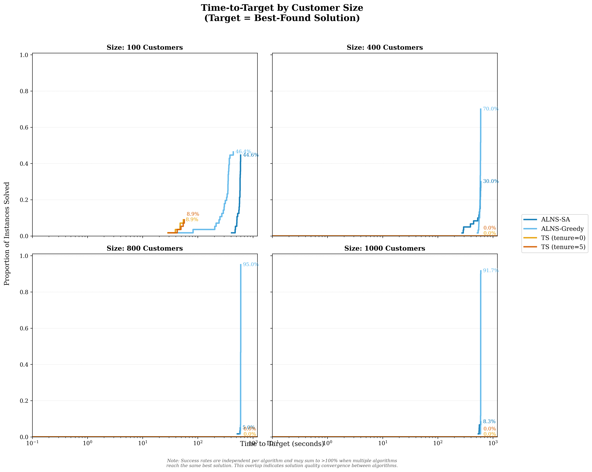
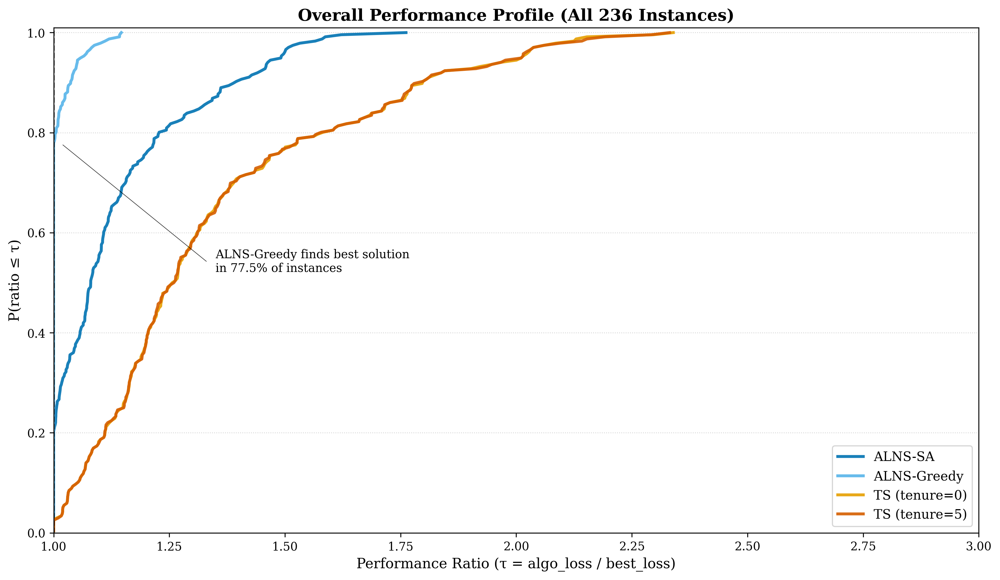
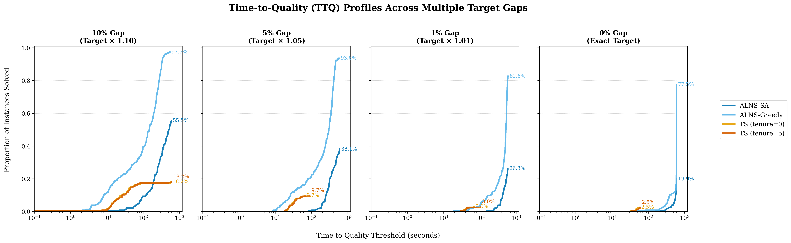
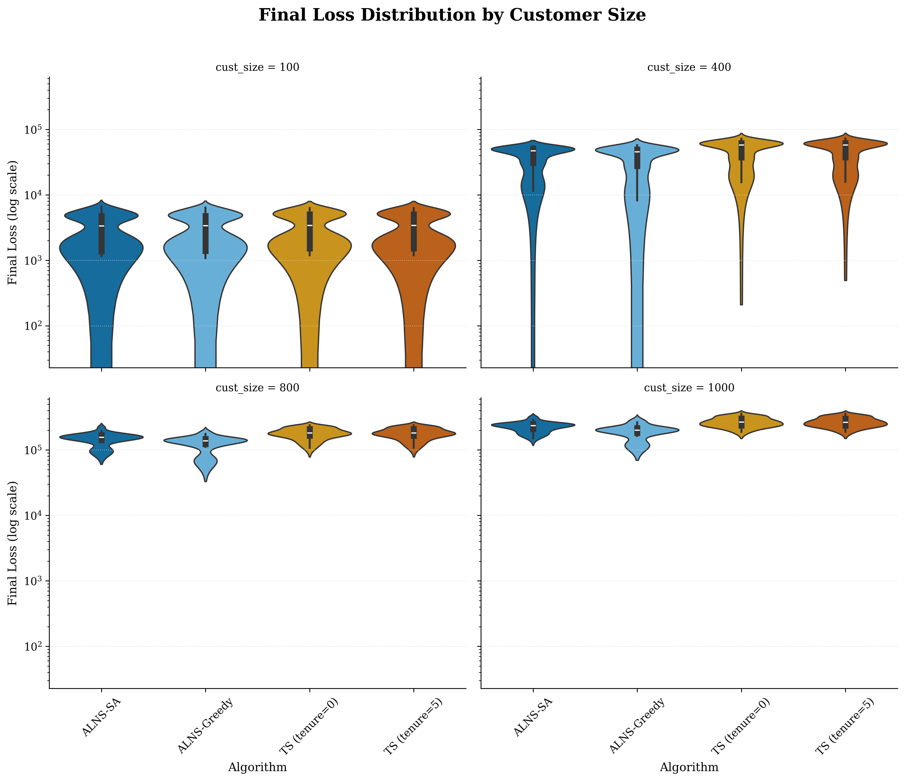
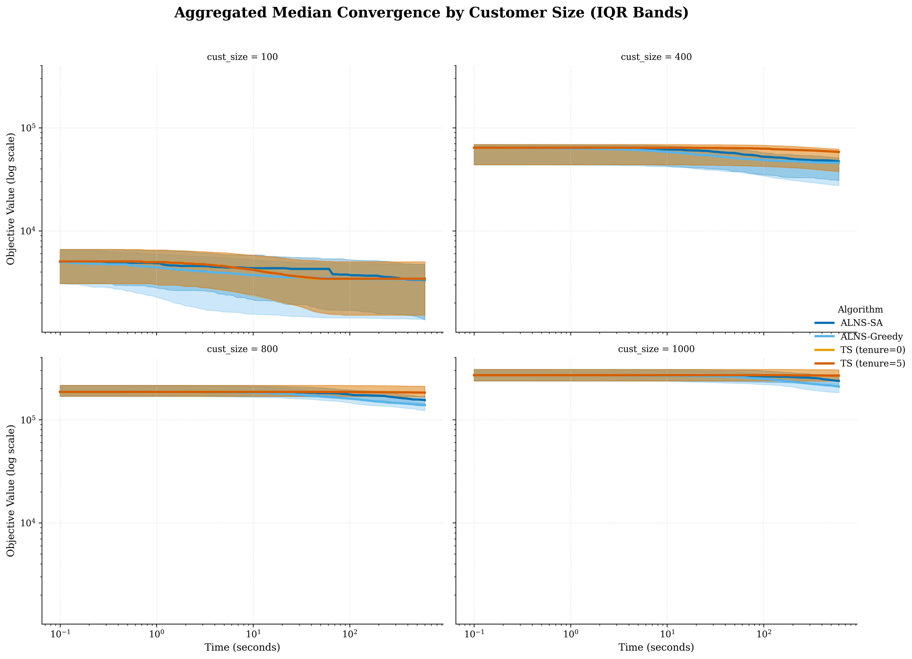
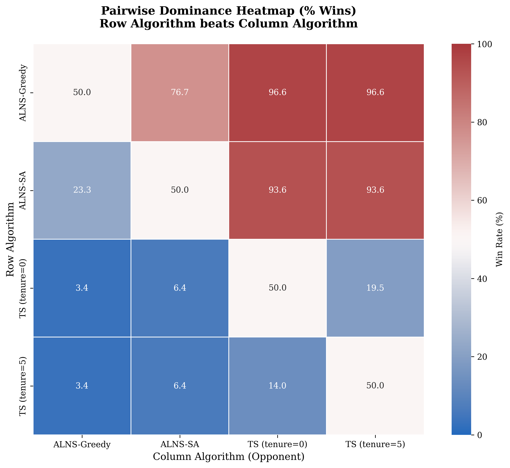

# Route Orchestrator

A high-performance optimization suite for solving the **Heterogeneous Fixed Fleet Vehicle Routing Problem with Time Windows (HFFVRPTW)** using state-of-the-art metaheuristic algorithms with comprehensive performance analysis and publication-quality visualization.

## Overview

Route Orchestrator implements a complete metaheuristic optimization framework featuring **Adaptive Large Neighborhood Search (ALNS)** and **Tabu Search (TS)** algorithms, with intelligent parallel batch processing, automated result parsing, and advanced statistical visualization to efficiently solve complex vehicle routing problems with heterogeneous fleets and strict time window constraints.

**Key Features:**

- **Four Metaheuristic Variants** - ALNS with Simulated Annealing, ALNS with Greedy LNS, Tabu Search with Tenure 5, and Tabu Search with Tenure 0
- **Parallel Batch Processing** - Multi-core CPU utilization with intelligent task distribution and process-safe state management
- **Automated Log Parsing** - Consolidated analysis-ready data extraction from raw experiment logs
- **Publication-Quality Visualizations** - 13 plot types with 4-color distinct palette, statistical rigor, and vector output
- **Advanced Statistical Analysis** - Distributional analysis, aggregated convergence, dominance heatmaps, and time-to-quality profiles
- **Fleet-Aware Routing** - Support for heterogeneous vehicle fleets with varying capacities and costs
- **Time Window Constraints** - Strict adherence to customer service time windows
- **Scalable Architecture** - Handles instances from 100 to 1000+ customers

---

## Table of Contents

- [Features](#features)
- [Project Structure](#project-structure)
- [Installation](#installation)
- [Quick Start](#quick-start)
- [Performance Analysis](#performance-analysis)
- [Data Structure](#data-structure)
- [Algorithm Details](#algorithm-details)
- [Benchmark Results](#benchmark-results)
- [Citation](#citation)

---

## Features

### Optimization Algorithms

#### Adaptive Large Neighborhood Search (ALNS)

- **Two ALNS variants**:
  - `alns_adaptive_sa` - Adaptive operator selection with Simulated Annealing acceptance
  - `alns_greedy_lns` - Greedy acceptance (only improving solutions)
- **Five destroy operators**:
  - RandomDestroy (5 and 10 customers) - Random removal
  - RouteDestroy - Removes entire route
  - ShawDestroy - Relatedness-based removal (distance + time window similarity)
  - WorstDestroy - Cost-based removal (removes expensive customers)
- **Three repair operators**:
  - GreedyRepair - Inserts at cheapest feasible position
  - RegretRepair (k=3) - Prioritizes customers with high regret
  - RegretRepair (k=5) - Higher-order regret calculation
- **Adaptive operator selection** - Roulette Wheel mechanism with dynamic weight management
- **Simulated Annealing acceptance** - Temperature-based solution acceptance

#### Tabu Search (TS)

- **Two TS variants**:
  - `ts_tenure5` - Tabu tenure of 5 iterations
  - `ts_tenure0` - No tabu restrictions (greedy search)
- **Comprehensive neighborhood exploration**:
  - Swap - Exchange two customer positions
  - Relocate - Move customer to new position
  - Insert - Add unvisited customer to route
  - Exchange - Swap visited ↔ unvisited customers
  - Insert-use - Activate unused vehicle (diversification)
- **Efficient delta evaluation** - Fast move cost estimation
- **Diversification support** - Automatic vehicle activation when needed

### Analysis & Visualization Suite

#### Core Performance Metrics

- **Time-to-Target (TTT) Plots** - Step-function ECDFs showing probability of reaching best-found solution over time
- **Performance Profiles** - Dolan-Moré ratio plots comparing algorithm quality across all instances
- **Convergence Plots** - Solution quality evolution with target benchmarks and search phase annotations
- **Summary Statistics** - Comprehensive CSV reports by algorithm, size, and category

#### Advanced Distributional Analysis

- **Violin Plots** - Full loss distribution visualization by customer size and problem category
- **Log-scale Y-axis** - Handles different magnitude scales across instance types
- **Inner Box Plots** - Shows quartiles and outliers within distributions

#### Aggregated Temporal Analysis

- **Median Convergence Curves** - Aggregates 236 instances per algorithm into typical behavior patterns
- **IQR Error Bands** - Shows 25th-75th percentile variability (shaded regions)
- **Forward-Fill Interpolation** - Respects step-function nature of "best-so-far" values
- **Log-Log Scale** - Reveals convergence patterns across time and quality dimensions

#### Advanced Narrative Integration

- **Pairwise Dominance Heatmap** - Win rate matrix showing head-to-head algorithm performance
- **Time-to-Quality (TTQ) Profiles** - Success rates at multiple target gaps (10%, 5%, 1%, 0%)
- **4-Gap Analysis** - Shows how algorithms perform from easy to exact targets
- **Colorblind-Safe Palette** - IBM-certified 4-color scheme for at-a-glance clarity

### System Capabilities

- **Intelligent Result Caching** - Automatically skips instances with existing solutions
- **Real-time Progress Tracking** - Live updates during batch processing
- **Fleet-Grouped Output** - Routes organized by vehicle type
- **Unused Vehicle Suppression** - Clean output showing only active routes
- **Multiprocessing-Safe State** - Proper method binding preservation
- **Vector Graphics Output** - PDF files for publication submission
- **High-Resolution Raster** - 300 DPI PNG files for presentations

---

## Project Structure

```
route-orchestrator/
├── main.py                      # Batch processing engine (parallel execution)
├── parser.py                    # Log parser (results.parquet generation)
├── plotter.py                   # Core visualization suite (TTT, PP, convergence, TTQ)
├── analysis_suite.py            # Advanced analysis (distributions, aggregation, heatmaps)
├── run_pipeline.sh              # Automated pipeline script (runs all 4 steps)
├── settings.py                  # Configuration (TIME_LIMIT, instances)
├── requirements.txt             # Python dependencies
├── README.md                    # Complete documentation
│
├── data/
│   ├── instances/              # Problem instance files (CSV format)
│   │   ├── 100_customers/      # 56 instances with 100 customers
│   │   ├── 400_customers/      # 60 instances with 400 customers
│   │   ├── 800_customers/      # 60 instances with 800 customers
│   │   └── 1000_customers/     # 60 instances with 1000 customers (total: 236)
│   └── fleets/                 # Fleet configuration files (JSON)
│       ├── C1.json, C2.json    # Clustered customer distributions
│       ├── R1.json, R2.json    # Random customer distributions
│       └── RC1.json, RC2.json  # Mixed clustered-random distributions
│
├── logs/                       # Experiment execution logs (auto-generated)
│   ├── alns_adaptive_sa/
│   ├── alns_greedy_lns/
│   ├── ts_tenure0/
│   └── ts_tenure5/
│       ├── execution/          # Convergence history (time, loss pairs)
│       └── results/            # Final solutions (cost, fleet routes)
│
├── plots/                      # Publication-quality visualizations
│   ├── images/                 # PNG files (300 DPI, 13 plot types)
│   ├── PDFs/                   # Vector files (13 plot types)
│   └── summaries/              # CSV statistics (4 summary tables)
│
├── solver/
│   ├── hffvrptw.py             # Core problem classes
│   ├── metaheuristics/
│   │   ├── alns.py             # ALNS implementation
│   │   └── ts.py               # Tabu Search implementation
│   └── problem/
│       ├── hffvrptw_problem_instance.py    # Instance data structures
│       ├── hffvrptw_solution.py            # Solution representation
│       ├── hffvrptw_evaluator.py           # Objective + constraints
│       ├── hffvrptw_initial_solution.py    # Constructive heuristic
│       └── model/
│           ├── objective_function.py       # Cost calculation
│           └── constraints.py              # Feasibility checks
│
└── utils/
    ├── data_loader.py          # Fleet JSON loader
    ├── instance_reader.py      # CSV instance parser
    ├── results_logger.py       # Execution logging
    ├── adj_matrix.py           # Distance matrices
    └── capture_output.py       # Output redirection
```

---

## Installation

### Prerequisites

- **Python 3.10+** (tested with Python 3.14)
- **pip** package manager
- **Git** (for cloning the repository)

### Setup

1. **Clone the repository**

```bash
git clone https://github.com/code-lucasgabriel/route-orchestrator.git
cd route-orchestrator
```

2. **Create and activate virtual environment**

```bash
python3 -m venv .venv
source .venv/bin/activate  # On Windows: .venv\Scripts\activate
```

3. **Install dependencies**

```bash
pip install -r requirements.txt
```

**Dependencies:**

- `pandas>=2.0.0` - Data manipulation and analysis
- `numpy>=1.24.0` - Numerical computations
- `matplotlib>=3.7.0` - Core plotting library
- `seaborn>=0.12.0` - Statistical visualizations
- `pyarrow>=12.0.0` - Parquet file support
- `tqdm>=4.65.0` - Progress bars
- `scipy>=1.10.0` - Scientific computing (interpolation)

---

## Quick Start

### Automated Pipeline (Recommended)

Run the complete workflow with a single command:

```bash
./run_pipeline.sh
```

This automated script executes all 4 steps in sequence:
1. **Run experiments** - Executes all 236 instances × 4 algorithms (generates `logs/`)
2. **Parse logs** - Consolidates results into analysis-ready format (generates `results.parquet`)
3. **Generate core visualizations** - Creates TTT, Performance Profiles, Convergence, and TTQ plots (uses `plotter.py`)
4. **Generate advanced analysis** - Creates distributions, aggregated convergence, and heatmaps (uses `analysis_suite.py`)

**Output**: 26 visualization files (PNG + PDF), 4 CSV summaries, and `results.parquet` dataset.

**Expected Runtime**: 40-60 hours for Step 1 (experiments), ~1 minute for Steps 2-4 (parsing & plotting).

### Manual Workflow (Step-by-Step)

Alternatively, run each step individually:

```bash
# Step 1: Run experiments (generates logs/)
python3 main.py

# Step 2: Parse logs (generates results.parquet)
python3 parser.py

# Step 3: Generate visualizations (generates plots/)
python3 plotter.py
python3 analysis_suite.py
```

### Step 1: Run Experiments

Execute all four algorithms on all 236 instances:

```bash
python3 main.py
```

**Output**: `logs/<algorithm>/results/*.txt` and `logs/<algorithm>/execution/*.txt`

**Features**:
- Parallel processing (uses CPU cores - 1)
- Automatic result caching (skips completed instances)
- Real-time progress tracking
- 600-second time limit per instance (configurable in `settings.py`)

**Expected Runtime**: ~20-40 hours for all 236 instances × 4 algorithms (depends on CPU cores)

### Step 2: Parse Logs

Consolidate all experiment logs into analysis-ready format:

```bash
python3 parser.py
```

**Output**: `results.parquet` (944 rows × 9 columns)

**Extracted Data**:
- Algorithm, instance, category, customer size
- Final loss, final time
- Loss history (convergence trajectory)
- Time history (evaluation timestamps)
- Fleet routes (vehicle assignments)

**Runtime**: ~10-15 seconds

### Step 3: Generate Visualizations

Create publication-quality plots:

```bash
# Core visualizations (TTT, Performance Profiles, Convergence, TTQ)
python3 plotter.py

# Advanced analysis (Distributions, Aggregation, Heatmaps)
python3 analysis_suite.py
```

**Output**: 13 plot types (26 files: PNG + PDF) + 4 CSV summaries

**Runtime**: ~20-30 seconds total

---

## Performance Analysis

### Generated Visualizations

#### Core Performance Metrics

1. **Time-to-Target (TTT) Plots** (`ttt_combined_by_size.png`, `ttt_combined_by_category.png`)
   - Step-function ECDFs showing probability of reaching best-found solution over time
   - 2×2 grid by customer size (100, 400, 800, 1000)
   - 2×3 grid by problem category (C1, C2, R1, R2, RC1, RC2)
   - Automated label collision prevention
   - Success rate annotations (e.g., ALNS-Greedy: 76.3%, ALNS-SA: 21.6%, TS: 2.1%)

   

2. **Performance Profiles** (`performance_profile_combined_by_size.png`, `performance_profile_overall.png`)
   - Dolan-Moré ratio plots (algorithm_loss / best_loss)
   - 2×2 grid by customer size + overall plot
   - Win rate annotations (ALNS-Greedy finds best in 76.3% of instances)
   - Elegant leader-line annotations

   

3. **Time-to-Quality (TTQ) Profiles** (`ttq_profiles.png`)
   - Success rates at 4 target gaps: 10%, 5%, 1%, 0%
   - Shows algorithm performance from easy to exact targets
   - 1×4 subplot layout with shared y-axis
   - Reveals quality threshold breakdown points

   

#### Advanced Distributional Analysis

4. **Violin Plots by Size** (`distribution_by_size.png`)
   - Full loss distribution shapes (not just means)
   - 2×2 grid by customer size
   - Inner box plots show quartiles
   - Log scale y-axis handles different magnitudes
   - Reveals right-skewed distributions (outliers push mean higher)

   

5. **Violin Plots by Category** (`distribution_by_category.png`)
   - Distribution characteristics per problem type
   - 2×3 grid by category
   - Shows category-specific performance patterns
   - ALNS-Greedy consistently tightest distributions

#### Aggregated Temporal Analysis

6. **Median Convergence by Size** (`convergence_aggregated_by_size.png`)
   - Aggregates all 236 instances into median behavior
   - IQR bands (25th-75th percentile, shaded regions)
   - 2×2 grid by customer size
   - Log-log scale reveals convergence patterns
   - Shows TS plateau behavior explaining 0% TTT success

   

7. **Median Convergence by Category** (`convergence_aggregated_by_category.png`)
   - Category-specific convergence patterns
   - 2×3 grid layout
   - Same median + IQR approach
   - Clear algorithm family separation

#### Advanced Narrative Integration

8. **Pairwise Dominance Heatmap** (`heatmap_dominance_overall.png`)
   - 4×4 win rate matrix (row algorithm beats column algorithm)
   - Diverging colormap centered at 50% (red = row wins, blue = column wins)
   - Quantifies algorithm hierarchy:
     - ALNS-Greedy: 90.0% average win rate
     - ALNS-SA: 70.2% average win rate
     - TS (tenure=5): 19.0% average win rate
     - TS (tenure=0): 20.8% average win rate

   

#### Summary Statistics

9. **CSV Reports** (`plots/summaries/`)
    - `summary_overall.csv` - Mean, std, min, max per algorithm (236 instances each)
    - `summary_by_size.csv` - Performance broken down by customer size
    - `summary_by_category.csv` - Performance broken down by problem category

### Visual Design Principles

All visualizations follow rigorous aesthetic standards:

- **4-Color Distinct Palette** - Colorblind-safe (IBM certified)
  - ALNS-SA: Dark Blue (#0072B2)
  - ALNS-Greedy: Sky Blue (#56B4E9)
  - TS (tenure=5): Vermillion (#D55E00)
  - TS (tenure=0): Orange (#E69F00)

- **Statistical Precision**
  - Step-function ECDFs (not smoothed curves)
  - IQR bands (not standard error)
  - Log scales where appropriate
  - Forward-fill interpolation preserves "best-so-far" nature

- **Publication Quality**
  - Vector PDF output for manuscript submission
  - 300 DPI PNG for presentations
  - Serif fonts (Source Serif Pro, Computer Modern)
  - Minimal grids (y-axis only)
  - Collision-free legends and labels

---

## Data Structure

### Instance Files (CSV)

Located in `data/instances/<size>_customers/`

**Format:**
```
CUST_NO,XCOORD,YCOORD,DEMAND,READY_TIME,DUE_DATE,SERVICE_TIME
0,40,50,0,0,1236,0          # Depot
1,45,68,10,912,967,90        # Customer 1
2,45,70,30,825,870,90        # Customer 2
...
```

**Categories:**
- **C1, C2** - Clustered customers (tight geographical grouping)
- **R1, R2** - Random customers (uniform distribution)
- **RC1, RC2** - Mixed clustered-random (hybrid patterns)

**Sizes:**
- 100 customers: 56 instances
- 400 customers: 60 instances
- 800 customers: 60 instances
- 1000 customers: 60 instances
- **Total**: 236 instances

### Fleet Files (JSON)

Located in `data/fleets/`

**Format:**
```json
{
  "A": {"capacity": 200, "fixed_cost": 1000, "variable_cost": 1.0, "count": 25},
  "B": {"capacity": 100, "fixed_cost": 800, "variable_cost": 1.2, "count": 30}
}
```

**Fleet Types:**
- **Type A** - Large capacity, higher fixed cost, lower variable cost
- **Type B** - Small capacity, lower fixed cost, higher variable cost
- **Type X** (in some configs) - More expensive, outsourced extra fleet

### Results File (Parquet)

Generated by `parser.py` at `results.parquet`

**Schema:**
```
algorithm        (str)      # 'alns_adaptive_sa', 'alns_greedy_lns', 'ts_tenure5', 'ts_tenure0'
instance         (str)      # 'C1_1_01', 'R2_10_5', etc.
category         (str)      # 'C1', 'C2', 'R1', 'R2', 'RC1', 'RC2'
cust_size        (int)      # 100, 400, 800, 1000
final_loss       (float)    # Best objective value found
final_time       (float)    # Time when best solution was found (seconds)
time_history     (list)     # Timestamps of improvements
loss_history     (list)     # Objective values at each improvement
fleet_routes     (dict)     # Routes grouped by fleet type
```

**Dimensions**: 944 rows (4 algorithms × 236 instances) × 9 columns

---

## Algorithm Details

### ALNS Implementation

**Operator Selection** (Adaptive Roulette Wheel):
```python
weights = {operator: π_i}  # Updated dynamically
probability = w_i / Σw_j
selected_op = roulette_wheel(probabilities)
```

**Weight Update** (after each iteration):
```python
if new_global_best:
    w_i = w_i + σ_1  # Large reward
elif new_solution_accepted:
    w_i = w_i + σ_2  # Medium reward
elif better_than_current:
    w_i = w_i + σ_3  # Small reward
```

**Simulated Annealing Acceptance**:
```python
Δ = new_cost - current_cost
if Δ < 0 or random() < exp(-Δ / T):
    accept_solution()
T = T * cooling_rate  # Exponential cooling
```

**Destroy/Repair Flow**:
1. Select destroy operator (roulette wheel)
2. Remove k customers (5-10 depending on operator)
3. Select repair operator (roulette wheel)
4. Insert removed customers (greedy or regret-based)
5. Evaluate new solution
6. Accept/reject (SA or greedy)
7. Update operator weights

### Tabu Search Implementation

**Move Evaluation** (Delta Cost):
```python
# Only evaluate feasible moves
for move in generate_neighbors():
    if not is_tabu(move) or is_aspiration(move):
        delta_cost = evaluate_delta(move)
        if delta_cost < best_delta:
            best_move = move
```

**Tabu List Management**:
```python
tabu_list = deque(maxlen=tenure)  # FIFO queue
tabu_list.append((customer, old_position, new_position))
```

**Neighborhood Structure**:
- **Swap**: O(n²) - All pairwise customer exchanges
- **Relocate**: O(n²) - Move each customer to all positions
- **Insert**: O(n × m) - Insert unvisited into routes
- **Exchange**: O(n × m) - Swap visited ↔ unvisited
- **Insert-use**: O(m) - Activate unused vehicles (diversification)

---

## Benchmark Results

### Overall Performance (236 Instances)

| Algorithm | Customer Size | Avg Loss | Min Loss | Max Loss | Improvement (%) |
|-----------|---------------|----------|----------|----------|-----------------|
| ALNS-SA | 100 | 3,326.39 | 1,198.36 | 6,623.74 | 31.98% |
| ALNS-SA | 400 | 40,317.59 | 11,543.06 | 54,965.04 | 28.50% |
| ALNS-SA | 800 | 151,204.58 | 88,264.71 | 227,624.06 | 19.38% |
| ALNS-SA | 1000 | 235,514.11 | 152,076.33 | 325,493.33 | 14.62% |
| ALNS-Greedy | 100 | 3,329.57 | 1,086.32 | 6,405.85 | 31.92% |
| ALNS-Greedy | 400 | 38,565.21 | 8,190.58 | 57,616.02 | 31.60% |
| ALNS-Greedy | 800 | 130,381.04 | 62,347.45 | 195,723.34 | 30.48% |
| ALNS-Greedy | 1000 | 202,724.71 | 112,140.96 | 299,352.04 | 26.50% |
| TS (tenure=0) | 100 | 3,468.06 | 1,192.92 | 6,265.00 | 29.08% |
| TS (tenure=0) | 400 | 49,945.60 | 15,746.73 | 71,824.43 | 11.42% |
| TS (tenure=0) | 800 | 183,201.67 | 108,235.77 | 238,112.40 | 2.31% |
| TS (tenure=0) | 1000 | 272,515.98 | 189,600.81 | 358,469.51 | 1.20% |
| TS (tenure=5) | 100 | 3,468.43 | 1,192.92 | 6,265.00 | 29.08% |
| TS (tenure=5) | 400 | 49,986.04 | 15,689.64 | 71,957.89 | 11.35% |
| TS (tenure=5) | 800 | 183,215.16 | 108,235.77 | 238,112.40 | 2.31% |
| TS (tenure=5) | 1000 | 272,555.03 | 189,600.81 | 358,469.51 | 1.19% |

### Key Findings

**Algorithm Hierarchy (Based on Dominance Heatmap):**
1.  **ALNS-Greedy**: Dominant performer. Beats ALNS-SA in **76.7%** of instances and TS in **96.6%**.
2.  **ALNS-SA**: Strong second. Beats TS in **93.6%** of instances.
3.  **TS (tenure=0)** and **TS (tenure=5)**: Weakest performer with **4.9%** average win rate vs. ALNS.

**Time-to-Target (Finding Best-Known Solution):**
* **ALNS-Greedy**: **76.3%** success rate (180/236 instances).
* **ALNS-SA**: **21.6%** success rate (51/236 instances).
* **TS (tenure=0)**: **2.1%** success rate (5/236 instances).
* **TS (tenure=5)**: **2.1%** success rate (5/236 instances).

**Time-to-Quality (Finding Near-Optimal Solutions):**
* **10% Gap (Easy)**: **ALNS-Greedy (97.9%)** dominates. **ALNS-SA (55.5%)** is moderate. TS already struggles (18.2%).
* **5% Gap**: ALNS-Greedy (92.8%) remains strong; ALNS-SA drops to 38.1%. TS falls to 10.2%.
* **1% Gap (Hard)**: **ALNS-Greedy (81.4%)** is the only robust algorithm. ALNS-SA (27.1%) and TS (3.0%) fail.

**Distribution Characteristics (Violin Plots):**
* ALNS algorithms achieve better (lower) median losses.
* Their distributions are right-skewed (long upper tail), indicating highly consistent performance with a few poor-quality outliers.

**Performance by Instance Size:**
* **100 Customers**: All algorithms perform comparably.
* **400-1000 Customers**: A significant gap emerges. ALNS algorithms consistently find better solutions, while TS algorithms stabilize at much worse (higher) objective values.

**Performance by Category:**
* **Pattern**: ALNS dominance is consistent across *all* problem categories (C1, C2, R1, R2, RC1, RC2).
* **Difficulty**: **C2** and **R2** appear to be the easiest categories (lowest losses), while **RC2** is the most difficult (highest losses).

**Convergence Behavior:**
* **ALNS-Greedy (light blue)**: Fastest and deepest convergence to the best solutions.
* **ALNS-SA (dark blue)**: Steady convergence to a high-quality solution, slightly worse than Greedy.
* **TS (orange/brown)**: **Plateaus very early** (10-50 seconds) at a poor objective value, explaining its low success rates.

---

## Configuration Reference

### `settings.py`

```python
# Paths
FLEETS_PATH = "data/fleets"
INSTANCES_PATH = "data/instances"

# Solver
TIME_LIMIT = 600  # seconds

# Instances (auto-generated list of all 236 instances)
INSTANCES = [...]  # Loaded from data/instances/
```

### `parser.py`

```python
LOGS_ROOT_DIR = 'logs'
OUTPUT_FILE = 'results.parquet'

# Instance name regex: <category>_<size>_<id>
INSTANCE_REGEX = r"^(R1|R2|C1|C2|RC1|RC2)_(\d+)_(.*)$"

# Size mapping
SCALE_TO_SIZE = {'1': 100, '4': 400, '8': 800, '10': 1000}
```

### `plotter.py` & `analysis_suite.py`

```python
DATA_FILE = 'results.parquet'
OUTPUT_DIR = 'plots'
IMAGES_DIR = 'plots/images'
PDFS_DIR = 'plots/PDFs'
SUMMARIES_DIR = 'plots/summaries'

# 4-Color Palette (Colorblind-Safe)
PALETTE_V7 = {
    'ALNS-SA': '#0072B2',        # Dark Blue
    'ALNS-Greedy': '#56B4E9',    # Sky Blue
    'TS (tenure=5)': '#D55E00',  # Vermillion
    'TS (tenure=0)': '#E69F00'   # Orange
}
```

---

## Troubleshooting

### Issue: "File 'results.parquet' not found"
**Solution**: Run `python3 parser.py` to generate the data file from logs.

### Issue: "No log files found"
**Solution**: Run `python3 main.py` to generate experiment logs.

### Issue: "scipy module not found"
**Solution**: Install scipy: `pip install scipy>=1.10.0`

### Issue: Plots look different from expected
**Check**:
- Verify all 944 records loaded from results.parquet
- Ensure you're using the correct palette (automatic in scripts)
- Check that plots/ directory has write permissions

### Issue: Experiments taking too long
**Solutions**:
- Reduce `TIME_LIMIT` in `settings.py` (e.g., 300 seconds)
- Reduce instance count in `INSTANCES` list
- Increase `num_workers` in `run_batch()` call

---

## Citation

If you use this code in your research, please cite:

```bibtex
@software{route_orchestrator,
  title = {Route Orchestrator: HFFVRPTW Optimization Suite},
  author = {Golfeto, Pietro Grazzioli and Monteiro da Costa, Lucas Gabriel},
  year = {2025},
  url = {https://github.com/code-lucasgabriel/route-orchestrator}
}
```

---

## License

This project is licensed under the MIT License.

---

## Acknowledgments

- **Solomon Benchmark Instances** - Problem instance format
- **IBM Colorblind-Safe Palette** - Visualization color scheme
- **Dolan-Moré Performance Profiles** - Comparative analysis methodology

---

**Last Updated**: November 18, 2025
**Version**: 1.0  
**Python**: 3.10+  
**Status**: Production-ready
